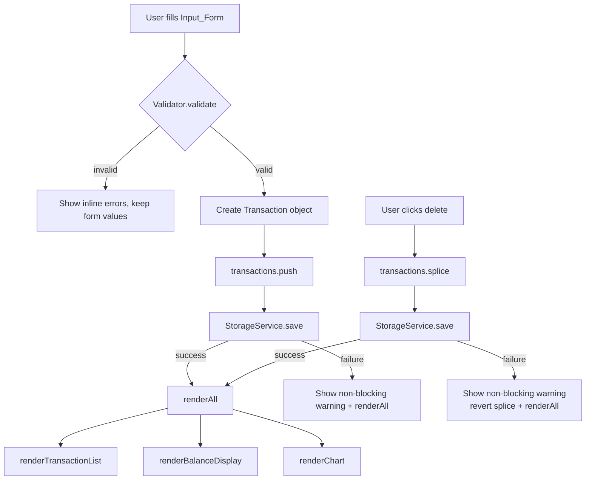

# Design Document — Expense and Budget Visualizer

## Overview

The Expense and Budget Visualizer is a zero-dependency, single-origin web application that runs entirely in the browser. It lets users record expense transactions by category, see their running balance, and visualize spending distribution as a pie chart. All data is persisted automatically to `localStorage` — no server, no build step, no framework.

The application ships as three files:

```
index.html     ← entry point, CDN script tag for Chart.js
css/style.css  ← all styling
js/app.js      ← all application logic
```

Chart.js is loaded from a CDN (`https://cdn.jsdelivr.net/npm/chart.js`) and is the only external dependency. If the CDN load fails, the app degrades gracefully: transaction entry, list management, and localStorage persistence all continue to work, and the chart area shows a friendly "Chart unavailable" message.

---

## Architecture

The application uses a **unidirectional data-flow** pattern without a framework:

```
User Action
    │
    ▼
Event Handler  (js/app.js — UI layer)
    │  calls
    ▼
State Mutation  (in-memory transactions array)
    │  then
    ├──► Persist  (StorageService.save)
    │
    └──► Render   (renderAll)
              ├── renderTransactionList()
              ├── renderBalanceDisplay()
              └── renderChart()
```

All state lives in a single module-level array `transactions`. Every user action (add, delete) mutates this array, persists it to localStorage, then calls `renderAll()` to synchronously re-render all three UI regions. Because rendering is synchronous and driven by the same JS event loop tick as the mutation, the "within one rendering frame" requirement is satisfied.



---

## Components and Interfaces

### 1. `Validator`

Pure functions; no DOM access. Returns a structured result object so the UI layer can display per-field messages.


```js
/**
 * @typedef {{ valid: boolean, errors: { name?: string, amount?: string, category?: string } }} ValidationResult
 */

const Validator = {
  /**
   * Validates raw form field values before a transaction is created.
   * @param {string} name
   * @param {string} amountRaw  — raw string from <input type="text">
   * @param {string} category
   * @returns {ValidationResult}
   */
  validate(name, amountRaw, category) { /* ... */ },

  /** Returns true only for strings that are not empty after trimming and ≤ 100 chars */
  isValidName(name) { /* ... */ },

  /** Returns true only for numeric values in (0.01, 999999999.99] */
  isValidAmount(amountRaw) { /* ... */ },

  /** Returns true only for 'Food' | 'Transport' | 'Fun' */
  isValidCategory(category) { /* ... */ },
};
```

### 2. `StorageService`

Wraps all `localStorage` access. Wraps reads in `try/catch` to handle `SecurityError` (private-browsing quota) and `SyntaxError` (corrupt JSON). Wraps writes in `try/catch` to handle `QuotaExceededError`.

```js
const STORAGE_KEY = 'ebv_transactions';

const StorageService = {
  /**
   * Loads and parses the transaction list.
   * @returns {{ data: Transaction[] | null, error: string | null }}
   */
  load() { /* ... */ },

  /**
   * Serializes and writes the transaction list.
   * @param {Transaction[]} transactions
   * @returns {{ success: boolean, error: string | null }}
   */
  save(transactions) { /* ... */ },
};
```

### 3. `TransactionService`

Pure business-logic functions over the transaction array.

```js
const TransactionService = {
  /** Sums all transaction amounts. Returns 0 for empty array. */
  computeBalance(transactions) { /* ... */ },

  /**
   * Aggregates totals per category.
   * @returns {{ Food: number, Transport: number, Fun: number }}
   */
  computeCategoryTotals(transactions) { /* ... */ },

  /** Creates a new Transaction object with a generated id and timestamp */
  createTransaction(name, amount, category) { /* ... */ },
};
```

### 4. `Formatter`

Pure string-formatting utilities.

```js
const Formatter = {
  /** Formats a number as a currency string, e.g. "$1,234.56" or "-$10.00" */
  formatCurrency(amount) { /* ... */ },

  /**
   * Truncates text to maxLen chars with ellipsis.
   * Default maxLen = 40.
   */
  truncate(text, maxLen = 40) { /* ... */ },

  /** Formats amount for list display: two decimal places, leading minus for negative */
  formatAmount(amount) { /* ... */ },
};
```

### 5. UI Rendering Functions

Stateless render functions that read from `transactions` (module-level) and write to the DOM. Calling them is always safe and idempotent for a given state.

| Function | DOM target | Responsibility |
|---|---|---|
| `renderTransactionList()` | `#transaction-list` | Build transaction rows or placeholder |
| `renderBalanceDisplay()` | `#balance-display` | Show formatted total balance |
| `renderChart()` | `#chart-canvas` | Update or create Chart.js instance |
| `renderAll()` | — | Calls all three above in order |

### 6. Chart Manager

Holds a reference to the single `Chart` instance. On each update, it calls `chart.data.datasets[0].data = newValues; chart.update()` rather than destroying and re-creating the chart (avoids animation flash).

```js
const ChartManager = {
  _instance: null,   // Chart.js Chart instance or null

  /** Creates the chart for the first time or re-uses existing. */
  render(categoryTotals) { /* ... */ },

  /** Destroys and nullifies the instance, used when no transactions exist. */
  destroy() { /* ... */ },
};
```

### 7. NotificationService

Renders non-blocking toast/banner messages for storage warnings and CDN failures. Messages auto-dismiss after 4 seconds.

```js
const NotificationService = {
  warn(message) { /* ... */ },
  error(message) { /* ... */ },
};
```


### 8. HTML Structure (`index.html`)

```html
<body>
  <header>
    <h1>Expense &amp; Budget Visualizer</h1>
    <section id="balance-section">
      <span id="balance-display">$0.00</span>
    </section>
  </header>

  <main>
    <!-- Left column -->
    <section id="form-section">
      <form id="input-form" novalidate>
        <input id="field-name" type="text" maxlength="100" />
        <span id="error-name" role="alert" aria-live="polite"></span>

        <input id="field-amount" type="text" inputmode="decimal" />
        <span id="error-amount" role="alert" aria-live="polite"></span>

        <select id="field-category">
          <option value="">-- Select category --</option>
          <option value="Food">Food</option>
          <option value="Transport">Transport</option>
          <option value="Fun">Fun</option>
        </select>
        <span id="error-category" role="alert" aria-live="polite"></span>

        <button type="submit">Add Transaction</button>
      </form>
    </section>

    <!-- Right column -->
    <section id="chart-section">
      <canvas id="chart-canvas"></canvas>
      <p id="chart-placeholder" hidden>No data available</p>
    </section>
  </main>

  <section id="transaction-section">
    <ul id="transaction-list" role="list"></ul>
    <p id="list-placeholder">No transactions yet.</p>
  </section>

  <div id="notification-area" aria-live="polite"></div>

  <!-- Chart.js CDN — loaded last to not block rendering -->
  <script src="https://cdn.jsdelivr.net/npm/chart.js" 
          onerror="window.__chartJsFailed = true"></script>
  <script src="js/app.js"></script>
</body>
```

---

## Data Models

### Transaction Object

All transactions are stored in memory as plain objects and serialized to JSON for localStorage.

```js
/**
 * @typedef {Object} Transaction
 * @property {string} id        — UUID v4 generated with crypto.randomUUID()
 * @property {string} name      — Item name, 1–100 non-whitespace chars
 * @property {number} amount    — Positive float, 0.01–999999999.99
 * @property {'Food'|'Transport'|'Fun'} category
 * @property {number} createdAt — Unix timestamp ms (Date.now())
 */
```

### In-Memory State

```js
/** @type {Transaction[]} */
let transactions = [];  // ordered by insertion (append-only; sorted desc for display)
```

Display order is determined by sorting descending on `createdAt` at render time. The source array stays append-order (simpler deletion by index).

### localStorage Schema

Key: `ebv_transactions`
Value: JSON-serialized array of `Transaction` objects.

```json
[
  {
    "id": "a3f1c2d4-...",
    "name": "Coffee",
    "amount": 4.50,
    "category": "Food",
    "createdAt": 1720000000000
  }
]
```

If the parsed value is not an array, or if any entry fails a basic shape check (`id`, `name`, `amount`, `category`, `createdAt` all present), the entire stored value is treated as corrupt and discarded with a warning.

### Category Color Map

```js
const CATEGORY_COLORS = {
  Food:      '#F87171',   // red-400
  Transport: '#60A5FA',   // blue-400
  Fun:       '#34D399',   // emerald-400
};
```

Colors are fixed and never derived from data, ensuring the legend always maps consistently.

---

## Correctness Properties

*A property is a characteristic or behavior that should hold true across all valid executions of a system — essentially, a formal statement about what the system should do. Properties serve as the bridge between human-readable specifications and machine-verifiable correctness guarantees.*

### Property 1: Whitespace-only names are invalid

*For any* string composed entirely of whitespace characters (spaces, tabs, newlines), `Validator.isValidName` SHALL return `false` and the transaction SHALL not be added.

**Validates: Requirements 1.3, 8.1**

---

### Property 2: Amount boundary rejection

*For any* numeric string representing a value ≤ 0 or > 999,999,999.99, or any non-numeric string, `Validator.isValidAmount` SHALL return `false`.

**Validates: Requirements 1.3, 8.2**

---

### Property 3: Amount boundary acceptance

*For any* numeric string representing a value in the range [0.01, 999,999,999.99], `Validator.isValidAmount` SHALL return `true`.

**Validates: Requirements 1.3, 8.2**

---

### Property 4: Transaction list persistence round-trip

*For any* array of valid `Transaction` objects, serializing it to localStorage with `StorageService.save` and then loading it back with `StorageService.load` SHALL produce an array that is deep-equal to the original.

**Validates: Requirements 6.1, 6.2, 6.3**

---

### Property 5: Balance computation correctness

*For any* non-empty array of transactions, `TransactionService.computeBalance` SHALL return a value equal to the arithmetic sum of all `amount` fields in that array.

**Validates: Requirements 4.1, 4.5**

---

### Property 6: Category totals partition

*For any* array of transactions, the sum of all values in the object returned by `TransactionService.computeCategoryTotals` SHALL equal the value returned by `TransactionService.computeBalance` for the same input.

**Validates: Requirements 5.1**

---

### Property 7: Currency formatter preserves sign and precision

*For any* finite number `n`, `Formatter.formatCurrency(n)` SHALL produce a string that:
- starts with `-` if and only if `n < 0`
- ends with exactly two decimal digit characters
- contains the currency symbol `$`

**Validates: Requirements 4.1, 4.6**

---

### Property 8: Truncation invariant

*For any* string `s` and max length `k`, `Formatter.truncate(s, k)` SHALL produce a string whose length is at most `k + 1` (to account for the ellipsis character), and SHALL equal `s` when `s.length ≤ k`.

**Validates: Requirements 2.2**

---

### Property 9: Adding a valid transaction grows the list by exactly one

*For any* transaction list and any valid transaction, adding that transaction SHALL increase the length of the list by exactly one, and the list SHALL contain an entry with the same name, amount, and category as the added transaction.

**Validates: Requirements 1.5, 2.1**

---

### Property 10: Deleting a transaction shrinks the list by exactly one

*For any* transaction list with at least one transaction, deleting a transaction by its `id` SHALL decrease the length of the list by exactly one, and no remaining entry SHALL have that `id`.

**Validates: Requirements 3.2**

---

### Property 11: Transaction display order is descending by creation time

*For any* array of transactions with distinct `createdAt` timestamps, the sequence returned by the sort function used at render time SHALL have each item's `createdAt` greater than or equal to the next item's `createdAt`.

**Validates: Requirements 2.1**

---

### Property 12: Zero-total category is excluded from chart data

*For any* array of transactions, if a category's total is zero while at least one other category has a non-zero total, the data array passed to the chart for that category SHALL be zero (excluded from visible slices), while the legend still lists all three categories.

**Validates: Requirements 5.7**

---

## Error Handling

| Scenario | Detection | Response |
|---|---|---|
| Invalid form input | `Validator.validate` returns errors | Inline `<span role="alert">` per field; form values preserved; no transaction added |
| localStorage unavailable on init | `try/catch` around `StorageService.load` | Initialize with empty array; `NotificationService.warn` shown |
| localStorage parse error on init | `JSON.parse` throws `SyntaxError` | Same as unavailable; corrupt data discarded |
| localStorage write failure | `try/catch` around `localStorage.setItem` catches `QuotaExceededError` | `NotificationService.warn`; in-memory state (and UI) updated anyway |
| Chart.js CDN failure | `onerror` on `<script>` sets `window.__chartJsFailed = true` | `ChartManager.render` checks flag; shows "Chart unavailable" message; all other features unaffected |
| Transaction limit reached (1000) | Pre-check before `transactions.push` | Form submission blocked; inline notification shown; existing data unchanged |
| Delete persistence failure | `StorageService.save` returns `{ success: false }` | Revert the in-memory splice; re-render; `NotificationService.error` shown |
| Corrupt stored transaction shape | Shape validation inside `StorageService.load` | Entire stored array discarded; warn user |

Error messages are user-friendly (no stack traces exposed), and all non-blocking warnings auto-dismiss after 4 seconds.

---

## Testing Strategy

### Dual Testing Approach

This feature uses two complementary layers:
- **Unit / example-based tests** for specific scenarios, UI integration points, and edge cases.
- **Property-based tests** for pure functions with universal correctness properties (Validator, TransactionService, Formatter, StorageService serialization).

PBT is appropriate here because the Validator and formatting functions are pure, the input space is large (arbitrary strings, arbitrary numbers), and running 100+ iterations will catch boundary conditions that hand-written examples would miss.

### Property-Based Testing Library

Use **[fast-check](https://github.com/dubzzz/fast-check)** (MIT license, zero dependencies, works in Node and browser environments). Run tests with **Vitest** (or Jest) using `--run` for single-pass CI execution.

Install:
```bash
npm install --save-dev vitest fast-check
```

Each property-based test MUST run a minimum of **100 iterations** and MUST include a comment tag in the format:

```
// Feature: expense-budget-visualizer, Property N: <property_text>
```

### Unit Tests (Example-Based)

Target areas:
- `Validator.validate` with concrete valid and invalid combinations
- `StorageService.load` when localStorage is empty (`null` return from `getItem`)
- `renderTransactionList` renders placeholder when `transactions` is empty
- `renderChart` calls `ChartManager.destroy` when all transactions are deleted
- Chart.js CDN failure path: `window.__chartJsFailed = true` before `renderChart`
- 1000-transaction limit: 999 → add succeeds; 1000 → add blocked

### Property-Based Tests

Each test maps 1:1 to a Correctness Property from the design document.

| Test | Property | Generator(s) |
|---|---|---|
| Whitespace names rejected | Property 1 | `fc.stringOf(fc.constantFrom(' ', '\t', '\n'), { minLength: 1 })` |
| Out-of-range amounts rejected | Property 2 | `fc.oneof(fc.float({ max: 0 }), fc.float({ min: 1e9 }), fc.string())` |
| In-range amounts accepted | Property 3 | `fc.float({ min: 0.01, max: 999999999.99 }).map(n => n.toFixed(2))` |
| localStorage round-trip | Property 4 | `fc.array(arbitraryTransaction())` |
| Balance computation | Property 5 | `fc.array(arbitraryTransaction(), { minLength: 1 })` |
| Category totals partition | Property 6 | `fc.array(arbitraryTransaction())` |
| Currency formatter | Property 7 | `fc.float({ noNaN: true, noDefaultInfinity: true })` |
| Truncation invariant | Property 8 | `fc.string()`, `fc.integer({ min: 1, max: 200 })` |
| Add grows list by one | Property 9 | `fc.array(arbitraryTransaction())`, `arbitraryTransaction()` |
| Delete shrinks list by one | Property 10 | `fc.array(arbitraryTransaction(), { minLength: 1 })` |
| Display order descending | Property 11 | `fc.array(arbitraryTransaction(), { minLength: 2 })` with distinct timestamps |
| Zero-total category excluded | Property 12 | `fc.array(arbitraryTransaction())` with some categories potentially absent |

### Integration / Smoke Tests

- App loads from `index.html` in a headless browser (Playwright or jsdom) with empty localStorage → renders `$0.00` balance and placeholder text.
- CDN failure simulation: mock `<script onerror>` → chart-unavailable message appears, form still works.
- Full add-and-persist flow: add a transaction, reload the page, verify transaction is restored from localStorage.

### Accessibility

- All inline error `<span>` elements use `role="alert"` and `aria-live="polite"` so screen readers announce validation failures.
- Delete buttons include `aria-label="Delete [item name]"` for screen reader context.
- Color is never the sole differentiator — chart legend includes text labels alongside color swatches.
- Keyboard navigation: form fields and delete buttons are all reachable via Tab.
